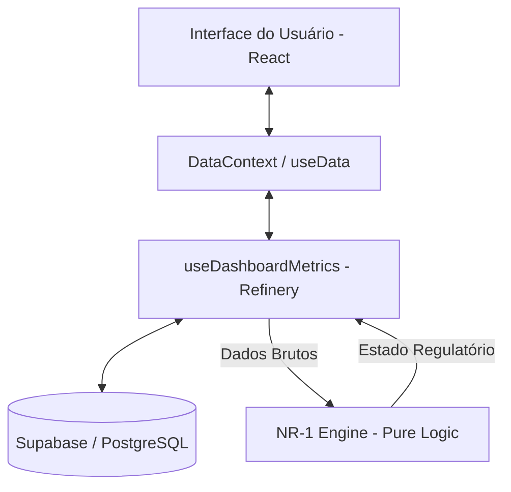

# Arquitetura do Sistema - NR1 PRO

Este documento descreve a arquitetura técnica, os limites de responsabilidade e o fluxo de dados do sistema NR1 PRO.

---

## 1. Visão Geral da Arquitetura

O NR1 PRO segue uma arquitetura desacoplada onde a **Inteligência de Negócio (Regulatória)** é isolada da **Infraestrutura** e da **Interface**.

---

## 2. Camadas e Responsabilidades

### 2.1. Camada de Apresentação (UI)
- **Localização**: `src/pages/`, `src/components/`
- **Responsabilidade**: Renderização declarativa. 
- **Restrição**: Proibido realizar cálculos de risco ou conformidade. Deve consumir o `regulatoryState` e os indicadores já processados fornecidos pelo contexto.
- **Autoridade**: Estética e UX.

### 2.2. Camada de Dados e Estado (Context/Hooks)
- **Localização**: `src/context/`, `src/hooks/`
- **Componentes Chave**: 
    - `DataContext`: O "Balde de Estado" global.
    - `useDashboardMetrics`: O "Refinador". Compete a ele buscar dados brutos (JSON/Rows) do Supabase e transformá-los no `RegulatoryEngineInput`.
- **Responsabilidade**: Sincronização em tempo real e cache de estado.

### 2.3. Camada de Domínio (Engine)
- **Localização**: `src/domains/risks/nr1.engine.ts`
- **Responsabilidade**: **A única autoridade regulatória do sistema.**
- **Natureza**: Função pura `(input) => output`. Livre de dependências externas (`window`, `supabase`, etc).
- **Autoridade**: Decisão de estados (ex: `CONFORME_OURO`, `ALERTA_CRITICO`).

### 2.4. Camada de Infraestrutura (Backend-as-a-Service)
- **Tecnologia**: Supabase
- **Responsabilidade**: Persistência, Autenticação e Segurança (RLS).
- **Design de Banco**: O esquema deve refletir as necessidades de evidência exigidas pela NR-1.

---

## 3. Fluxo de Decisão e Autoridade

1. **Input**: Uma mudança no banco (ex: novo risco cadastrado) dispara um `refetch`.
2. **Refining**: `useDashboardMetrics` agrupa o total de riscos e alertas.
3. **Deciding**: O objeto é passado para o `evaluateRegulatoryState` (Engine).
4. **Publishing**: O resultado (`regulatoryState`) é publicado no `DataContext`.
5. **Rendering**: A UI reage ao novo estado, mudando cores e labels automaticamente.

---

## 4. Limites Explícitos

| De | Para | Canal | Regra de Ouro |
| :--- | :--- | :--- | :--- |
| UI | DB | API/Hooks | UI nunca escreve no DB sem passar por validação de permissão. |
| Engine | UI | Context | A Engine nunca sabe onde ou como os dados serão exibidos. |
| UI | Engine | Context | A UI nunca "pula" estados da Engine. |

---

## 5. Manutenção e Extensão

Para adicionar uma nova regra de segurança:
1. Adicione o campo necessário no `RegulatoryEngineInput` (Engine).
2. Atualize o `useDashboardMetrics` para coletar esse dado do banco.
3. Implemente a lógica de estado na Engine.
4. A UI refletirá a mudança automaticamente via `regulatoryState`.
