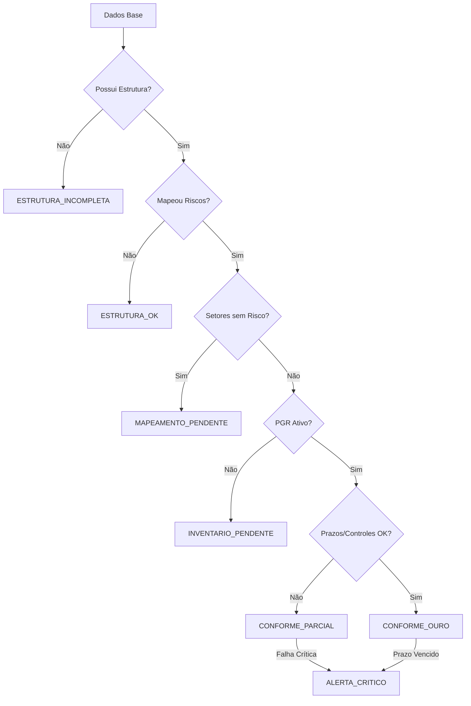

# NR-1 Regulatory Contract (Contrato Ouro)
**Versão:** 1.0.0  
**Status:** Imutável / Normativo  
**Escopo:** NR1 PRO - Engine de Gestão de Riscos Ocupacionais

---

## 1. Princípios do Contrato Ouro

O "Contrato Ouro" estabelece a confiança regulatória do sistema NR1 PRO. Ele se baseia na premissa de que a conformidade deve ser **demonstrada por evidências positivas** e não apenas pela ausência de erros.

- **Centralidade Decisória**: Toda e qualquer decisão sobre o status de conformidade de uma organização é de competência exclusiva do Motor Regulatório.
- **Evidência sobre Inferência**: O sistema nunca assumirá "OK" por falta de dados. O estado de silêncio é tratado como incompletude.
- **Inteligência Desacoplada**: A interface do usuário (UI) é um terminal burro de exibição e coleta; ela nunca deve calcular conformidade.

---

## 2. Definição Semântica dos Estados

| Estado | Cor | Descrição Semântica | Gatilho (Trigger) |
| :--- | :--- | :--- | :--- |
| **ESTRUTURA_INCOMPLETA** | 🔴 | Falta de dados base obrigatórios. | `!empresaVerificada \|\| totalSetores == 0 \|\| totalFuncionarios == 0` |
| **ESTRUTURA_OK** | 🟡 | Cadastro validado, sem mapeamento de riscos. | Cadastro OK, mas `totalRiscos == 0`. |
| **MAPEAMENTO_PENDENTE** | 🟡 | Mapeamento iniciado, mas incompleto por setor. | `setoresSemRisco > 0`. |
| **INVENTARIO_PENDENTE** | 🟠 | Riscos mapeados, PGR inexistente ou inativo. | Mapeamento OK, mas `!pgrAtivo`. |
| **CONFORME_PARCIAL** | 🔵 | PGR ativo, mas com pendências de ciclo (ASO/Controles). | PGR OK, mas `examesVencidos > 0 \|\| medidasPendentes > 0`. |
| **CONFORME_OURO** | 🟢 | Estado pleno de conformidade contínua. | Todos os gatilhos anteriores em conformidade. |
| **ALERTA_CRITICO** | 🔴 | Violação grave ou risco iminente. | `alertasCriticos > 0 \|\| pgrVencido`. |

### 2.1. Fluxo de Transição (Visual)

---

## 3. Regras de Precedência e Transição

1. **Soberania do Alerta**: O estado `ALERTA_CRITICO` sobrepõe qualquer outro estado (Priority Overriding).
2. **Backward Blocking**: O motor impede o avanço de estado se o requisito anterior for perdido.
3. **Idempotência**: O motor deve retornar o mesmo estado para o mesmo `RegulatoryEngineInput`.

---

## 4. Orquestração de Agentes

O motor orquestra quatro agentes cujas validações compõem o veredito final:

- **⚖️ Agente Legal**: Valida a conformidade normativa (NR 1.5.3.1). Garante que o PGR/GRO tem validade jurídica e a empresa está verificada.
- **📑 Agente Fiscal**: Focado em prazos e eSocial. Monitora exames (ASO), treinamentos e envios de eventos S-2240.
- **🛠️ Agente Técnico**: Avalia a qualidade da Matriz de Risco (Severidade x Probabilidade).  
  - **Exposição ao Risco**: Calcula a evidência técnica agregada baseada no número de trabalhadores expostos por setor e função.
  - **Regra de Criticidade**: Qualquer risco com `Severidade * Probabilidade >= 20` é classificado como **Crítico** e gera um `alertaCritico`.
  - **Escala**: Utiliza a escala de 1 a 5 para ambos os eixos (Máx 25).
  - **Nota de Blindagem**: A exposição técnica é uma **evidência**, não uma decisão. O impacto regulatório ocorre apenas se houver criticidade detectada (`alertasCriticos > 0`).
- **📸 Agente de Evidências**: Valida a rastreabilidade física/digital da implementação das medidas e realização de exames.

---

## 5. Regras Arquiteturais

### 5.1. Segregação de Camadas
- **UI**: Casca puramente declarativa. Lê `regulatoryState` e renderiza componentes. Proibida de conter `ifs` sobre lógica de conformidade.
- **Hooks**: Normalização de dados brutos para o motor.
- **Motor (`nr1.engine.ts`)**: Função pura. Único detentor das regras de negócio regulatórias.

### 5.2. Contrato de Comunicação
A UI deve habilitar/desabilitar ações baseadas estritamente nos campos `progress` e `state` fornecidos pelo motor.

---

## 6. Cláusula de Proteção contra Regressão

Qualquer alteração que mova lógica de decisão de conformidade para fora do `nr1.engine.ts` é considerada uma violação deste contrato e deve ser prontamente revertida. O dashboard é uma representação visual do motor, não uma extensão dele.

---
**Assinado por:**
*Regulatory Architect Specialist - NR1 PRO*
